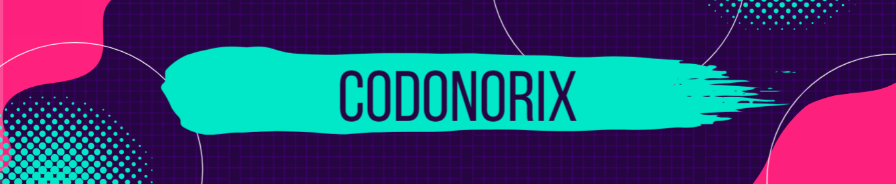

---

<h1 align="center">Introduction</h1>

I'm Logan, an enthusiastic developer who has had a passion for programming since the age of 14. By the age of 21, I had secured my first job in the world of programming by becoming a lecturer teaching full stack web development. Since then, I have done a continuous amount of work to improve my skills by creating a vast number of projects from websites to Minecraft plugins!

---

| Programming Skills  | VCS | Soft Skills |
| ------------- | ------------- | ------------- |
|   |   | 
|   |   | 
|   || 
|   || 
|   ||
|   ||

---

